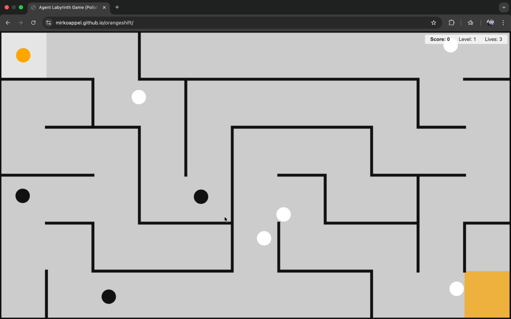

# ORANGE SHIFT  
A minimal maze survival game by Mirko Appel

---

## Play Now

👉 **[Click here to play Orange Shift](https://mirkoappel.github.io/orangeshift/)**  
*(GitHub Pages link — replace once deployed)*

---

## What is Orange Shift?

**Orange Shift** is a lightweight, browser-based game built with HTML, JavaScript, CSS and Three.js — no other dependencies, no build tools, just a single HTML-File.

You are a small orange sphere.  
You bounce through a procedurally generated maze.  
Avoid the dark agents. Touch the white ones to shift them orange.  
Every orange shift changes the balance.

**Find the exit. Don’t lose your light.**

---

## Backstory

> _No one knows why they turned orange._  
> _Maybe it was a glitch in the system._  
> _Maybe it was you._  
> _Now the color spreads — changing everything it touches._  
> _Find your way before the darkness catches up._

---

## How to Play

| Action              | Key                    |
|---------------------|------------------------|
| Move                | Arrow keys (↑ ↓ ← →)   |
| Avoid black agents  | 1-hit = lose 1 life    |
| Touch white agents  | Turns them orange (bonus!) |
| Reach the orange zone | Level complete        |

- You start with **3 lives**
- Levels get harder with **more/faster agents**
- After each level, your **score and bonus stats** are shown
- Game Over? Just hit **“Start New Game”**

---

## Origin & Context

Orange Shift was created as part of a Vibe Coding Experiment with Gemini 2.5 Pro (Canvas Mode) — an interface that enables humans and AI to build ideas together in real time. The game was developed by Mirko Appel, an innovation consultant and AI trainer helping brands and communicators explore creative applications of artificial intelligence.

This project was a playful exploration of:
- Conversational coding with a language model
- Rapid prototyping in the browser
- Minimalist game mechanics + emergent complexity

---

## Feedback & Contact

I'd love to hear your thoughts, ideas, or remix suggestions!  
Feel free to reach out via [LinkedIn](https://www.linkedin.com/in/mirko-appel/) or open an issue here on GitHub.

If you enjoyed playing, please ⭐️ the repo!

---

## Tech Stack

- HTML5 + CSS3
- [Three.js](https://threejs.org/) for simple 3D rendering
- Zero libraries or frameworks beyond that

---

## License

MIT License – free to play, fork, remix or extend.

---

> "Initiate Orange Shift."  
> – The Maze is waiting.
